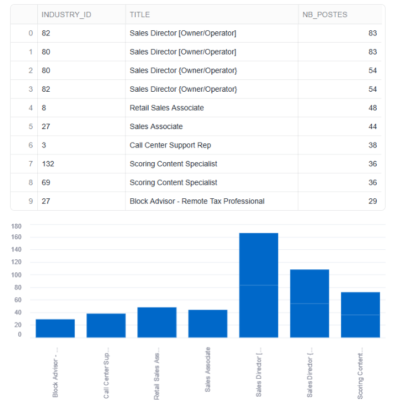
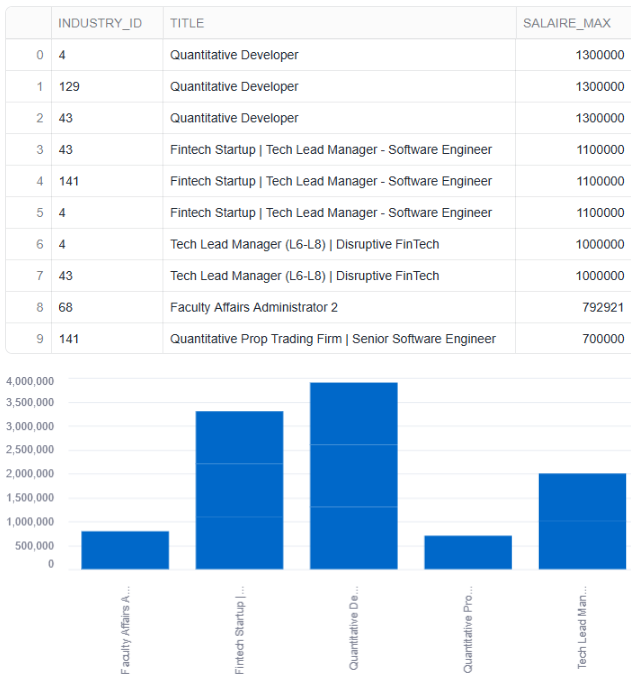
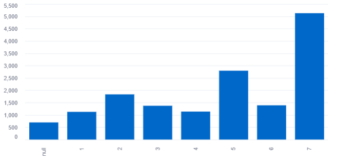
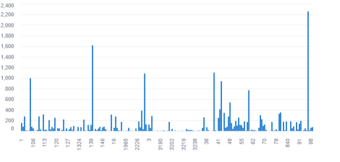
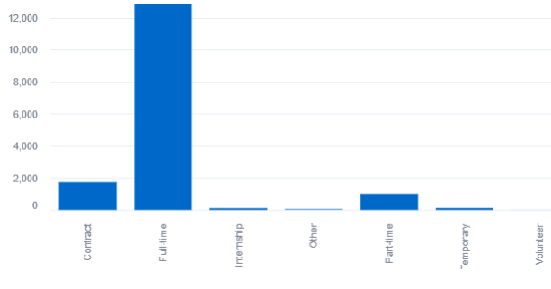

# 📊 LinkedIn Job Analytics avec Snowflake + Streamlit

Ce projet présente une analyse de données d’offres d’emploi LinkedIn à l’aide de **Snowflake** (ETL + SQL) et de **Streamlit intégré dans Snowflake** pour les visualisations interactives.

---

## 🧾 Objectifs pédagogiques

- Manipulation de données structurées (CSV, JSON) dans Snowflake
- Création de vues analytiques via SQL
- Déploiement d'applications Streamlit **directement dans Snowflake**
- Publication d’un dépôt GitHub structuré

---

## 🔄 Pipeline de traitement

| Étape | Description |
|-------|-------------|
| 1.    | Création des bases, schémas, file formats |
| 2.    | Création et peuplement des tables à partir de S3 |
| 3.    | Transformation des données (types, timestamps, jointures) |
| 4.    | Création de vues analytiques |
| 5.    | Création d'applications Streamlit dans Snowflake |

---

## 📂 SQL détaillé

Chaque fichier `.sql` contient des commentaires :

- `0_init.sql` : création de la base de données
- `1_creation_Import_Table.sql` : schéma des tables CSV & JSON + COPY depuis S3
- `02_Creation_View.sql` : jointures, enrichissements, creation des vieaws
- `03_KPI.sql` : vues analytiques par indicateur

---

## 📊 Analyses et Visualisations (Streamlit)

Chaque visualisation est codée dans un fichier `.py` exécuté depuis Streamlit dans Snowflake.

---
✅ A. Top 10 titres de postes les plus publiés par industrie
Vue SQL : vw_top_titles_by_industry

Visualisation : graphique à barres verticales (ou horizontales) — représentation du nombre de postes par titre et par industrie

✅ B. Top 10 postes les mieux rémunérés par industrie
Vue SQL : vw_top_salaries_by_industry

Visualisation : graphique à barres horizontales

✅ C. Répartition des offres par taille d'entreprise
Vue SQL : vw_jobs_by_company_size

Visualisation : diagramme circulaire (st.pyplot avec matplotlib)

✅ D. Répartition des offres par secteur d’activité
Vue SQL : vw_jobs_by_industry

Visualisation : graphique en barres

✅ E. Répartition des offres par type d’emploi
Vue SQL : vw_jobs_by_type

Visualisation : camembert ou histogramme

## 🛠️ Problèmes rencontrés et solutions apportées

***1. ✅ Mauvais nombre de colonnes dans le fichier CSV***

* **Problème :** La table job_postings chargée depuis le fichier CSV contenait 27 colonnes, alors que la table cible n’en attendait que 25.

* **Cause :** Certaines lignes contenaient des champs mal encodés ou des séparateurs , non échappés dans des descriptions longues.

* **Solution :**

  * Création d’une table intermédiaire job_postings_stage avec tous les champs en type STRING ou FLOAT
  * Utilisation de la commande :
COPY INTO job_postings_stage FROM @linkedin_stage/job_postings.csv FILE_FORMAT = csv_format ON_ERROR = 'CONTINUE';

  * Vérification du schéma avec :
DESC TABLE job_postings_stage;
SELECT * FROM job_postings_stage LIMIT 10;

  * Ensuite, transformation explicite et contrôlée dans une table job_postings finale avec types et conversions (TO_TIMESTAMP_NTZ()).

***2. ✅ Problème de conversion de dates (timestamp)***

* **Problème** : Certaines colonnes comme original_listed_time, expiry, closed_time étaient encodées en millisecondes UNIX.

* **Cause** : Les données n’étaient pas au bon format pour TIMESTAMP dans Snowflake.

* **Solution** : Conversion manuelle avec division par 1000 :

TO_TIMESTAMP_NTZ(original_listed_time / 1000)

***3. ✅ Tables JSON affichant une seule ligne***
* **Problème** : Lors de l’utilisation directe des commandes COPY INTO sur les fichiers JSON (companies.json, job_industries.json...), la table ne contenait qu’une seule ligne.

* **Cause** : Les fichiers JSON contenaient des tableaux imbriqués.

* **Solution** :

Utilisation de la fonction LATERAL FLATTEN pour parcourir chaque élément du tableau JSON :

SELECT
  value:company_id::STRING AS company_id,
  value:name::STRING AS name
FROM companies_raw,
LATERAL FLATTEN(input => v);

Ce modèle a été répliqué pour toutes les tables *_raw.

***4. ✅ Problèmes de jointure entre job_postings et companies***
*  **Problème :** La jointure entre job_postings.company_name (en FLOAT) et companies.name (STRING) ne retournait pas de correspondance.

* **Cause :** Type non homogène et variation dans les formats de noms (casse, espaces, majuscules).

* **Solution :**

Conversion explicite du nom de l’entreprise en STRING :

TRIM(LOWER(jp.company_name::STRING)) = TRIM(LOWER(c.name))

***6. ✅ Base de données non visible dans l’interface Streamlit Snowflake***
*  **Problème :** La base de données linkedin chargée n’était pas visible depuis Streamlit dans Snowflake.

* **Cause :** Mauvaise sélection du contexte ou rôle (role) dans Snowflake Web UI.

* **Solution :**

Vérification du rôle actif (SYSADMIN ou ACCOUNTADMIN)

Ajout explicite des lignes :

USE ROLE SYSADMIN;
USE DATABASE linkedin;
USE SCHEMA public;

***7. ✅ Pas de résultat retourné pour certaines vues***
*  **Problème :** La vue vw_top_titles_by_industry retournait "Query produced no results".

* **Cause :** Pas de correspondance entre job_postings.job_id et job_industries.job_id.

* **Solution :**

Vérification du contenu de chaque table :

SELECT COUNT(*) FROM job_postings;
SELECT COUNT(*) FROM job_industries;
SELECT COUNT(*) FROM job_postings jp JOIN job_industries ji ON jp.job_id = ji.job_id;

Nettoyage, rechargement ou contrôle qualité si nécessaire.